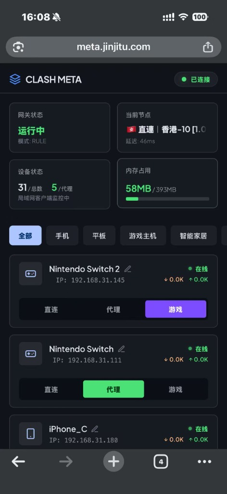
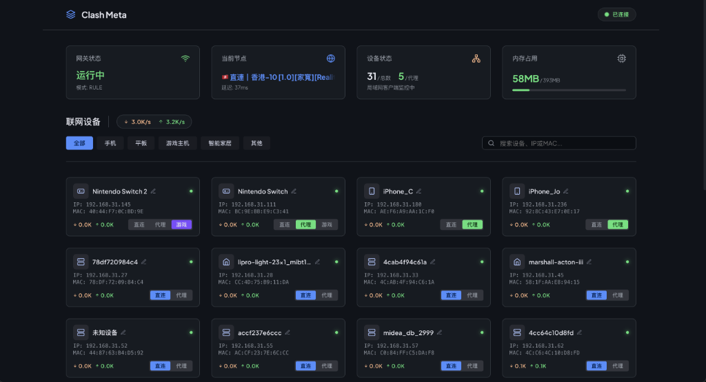

# Clash Meta 🚀
> 家用路由器 Clash (Mihomo) 网页端设备分流与游戏加速管理器

<table align="center" border="0">
  <tr>
    <td align="center" valign="middle" style="border: none;">
      
    </td>
    <td align="center" valign="middle" style="border: none;">
      
    </td>
  </tr>
</table>

**Clash Meta** 是一款专为家用/软路由环境打造的 Clash (Mihomo) 辅助控制台。通过 NAS 容器部署，以 SSH 协议安全联动路由器上的 Clash Meta 内核，提供设备级透明代理、AI 强化分流和 Switch 游戏加速功能。

---

## 🎯 解决什么痛点？

* **🇨🇳 国内环境翻墙难，直连 Google/OpenAI 等 443 端口失败**：GFW 对 HTTPS 443 端口进行深度包检测，直连 YouTube、Google Gemini、ChatGPT 等海外服务频繁断连或超时。本项目通过 iptables MAC 地址劫持 + Clash Meta 透明代理，为本机设备自动分配最优代理节点。
* **📱 多设备网络策略冲突**：家里手机、PC、Switch、电视盒子等设备同时在线，不同设备需要不同的网络策略——手机需要翻墙浏览，电视盒子需要国内直连（否则国内视频 App 卡顿），Switch 需要游戏专线。本系统通过 Web UI 一键为每台设备分配独立策略，不用逐台配置网络参数。
* **🎮 Switch 联机掉线、商店打不开**：Switch 使用 UDP 联机匹配，但 UDP 无法被 REDIRECT 透明代理劫持，导致 NAT 类型为 B（受限）而非 A（开放）。且 Clash 自动测速切换节点时出口 IP 突变，直接打断任天堂联机匹配。游戏模式提供**锁定物理节点**功能和独立 Nintendo CDN 域名规则（`atum.download.nintendo.net` / `ctest.cdn.nintendo.net`），确保商店和下载全程走游戏专线，不掉线。
* **🤖 AI 类服务（Gemini/ChatGPT）访问不稳定**：香港 IP 被 Google AI 服务封禁（Gemini 在香港不可用），普通代理节点可能路由到香港出口导致无法访问。AI 强化模式使用独立 **IPLC 中继节点池** + 排除香港节点 + 硬编码 28+ AI 域名规则（OpenAI/Claude/Gemini/Google AI 等），确保 AI API 走高质量专线。
* **⚠️ 路由器重启后配置全丢**：OpenWrt 路由器重啟后`/tmp` 目录清空（Clash 内核、Country.mmdb），`/data/ShellCrash/configs/mac` 白名单文件有时清空。本系统容器在启动时自动检测路由器状态，从 NAS 备份恢复 Clash 内核、GeoIP 数据库、设备白名单和 iptables 规则，实现全自动自愈。
* **❌ YouTube 播放失败（QUIC 绕过代理）**：浏览器优先使用 QUIC (UDP 443) 协议连接 YouTube，但 iptables REDIRECT 只劫持 TCP，UDP 协议直接走 GFW 被阻断。本系统通过 **UDP 443 REJECT 规则**（`forwarding_rule` 链）强制 QUIC 退回到 TCP + HTTPS，配合 Clash SNI 嗅探器，确保 REDIR 透明代理中的 443 端口 HTTPS 连接正常工作。
* **⚠️ 设备配置状态不同步**：前端显示设备已开启 AI 模式，但路由器白名单中却没有该设备的 MAC，导致流量绕过 Clash 直连 GFW 被拦截（原因是容器本地文件与路由器 whitelist 不持久化同步，或并发 enable/disable 竞态冲突）。本系统在启动时以容器本地文件为权威数据源**反向同步**路由器白名单，并在禁用设备时使用原子操作替代读-改-写，消除竞态窗口。
* **🔄 代理节点无效但无感知**：Clash 自动测速可能选中一个距离目标 CDN 延迟低但丢包率高的节点。游戏加速模式采用 **5 次多采样丢包+延迟测速**，优先按丢包率排序，确保联机不掉包。日常静默优化每 30 分钟重测一次，切换阈值 >200ms，避免频繁跳变。

---

## 🌟 核心功能

* **📱 设备自动发现与三态分流**：自动扫描 ARP+DCHP 的局域网在线设备，支持自定义别名。一键切换**直连/代理/AI 强化/游戏加速**四种状态。
* **🎮 游戏加速（Switch 优化）**：
  * 独立 **日本/韩国/台湾** 节点池，Nintendo CDN 实测选优。
  * 5 次多采样丢包+延迟测速，**丢包率优先**再比延迟。
  * LOCK/UNLOCK 锁定机制：锁定后不触发测速切换，永不掉线。
  * 注入 Nintendo CDN 域名规则（`atum.download.nintendo.net` 等），确保商店和下载走游戏节点。
* **🤖 AI 强化**：
  * 硬编码 OpenAI、Gemini、Claude、Google AI 等 28+ 域名规则。
  * 独立 IPLC 中继节点池（排除香港节点，避免 Gemini 不可用）。
  * 单次延迟测速，日常更新不产生额外丢包。
* **🧬 SNI 嗅探器 (Sniffer)**：Clash Meta 内置 TLS 连接嗅探，无需 geoip/geosite 数据库即可识别目标域名，REDIR 模式下 443 端口 HTTPS 正常连接。
* **🔒 设备锁定与状态持久化**：测速结果（delay/loss/perNodeResults）、锁定状态（LOCK/UNLOCK）持久化到 `speedtest_state.json`，容器重启后自动恢复。
* **🛡️ SystemValidator 智能清理**：设备连续 3 次 DHCP 检查不在线后才从配置中移除，防止容器启动瞬间 DHCP 未恢复就误清设备。
* **⏰ 定时优化**：每日 04:00 重测最优节点。游戏模式每 30 分钟静默测速，克制切换阈值 >200ms，避免频繁跳变。

---

## 📁 项目结构

```
src/
├── server.js               # 启动入口：设备同步、规则注入、守护进程
├── app.js                  # Express 路由挂载
├── config.js               # 配置管理
├── services/
│   ├── rulesEngine.js      # Clash 规则/代理组注入引擎（AI 域名 + Nintendo CDN）
│   ├── gameAccService.js   # 游戏加速：5 采样 Nintendo CDN 测速、日本加权
│   ├── aiBoostService.js   # AI 强化：单采样延迟测速、HK 过滤
│   ├── accelerationService.js # 启用/禁用加速统一入口
│   ├── sshService.js       # SSH 命令执行与文件传输
│   ├── clashService.js     # Clash HTTP API（带 10s 缓存）
│   ├── speedtestState.js   # 测速结果持久化 + LOCK/UNLOCK 状态
│   └── systemValidator.js  # 启动完整性验证（3 次确认后清理）
├── routes/
│   ├── gateway.js          # /api/status, /api/nodes, /api/select
│   ├── devices.js          # /api/devices 设备发现
│   ├── ai.js / game.js     # AI/Game 模式开关
│   ├── speedtest.js        # /api/speedtest/status, /lock, /trigger
│   └── whitelist.js        # MAC 白名单
├── utils/
│   ├── clashApiProxy.js    # Clash API 代理（SSH 隧道 + 10s 缓存）
│   └── proxyGroupDetector.js # 代理组链解析器
scripts/
├── setup_iptables.sh       # iptables TCP REDIRECT 重建
├── setup_quic_block.sh     # UDP 443 QUIC 阻断
└── check_modes.sh          # 四模式连通性检测
public/
├── index.html + app.js + style.css  # 前端 UI
```

---

## 🛠️ 前置条件

1. **路由器**：OpenWrt 或类似系统，已开启 SSH，安装 **Clash Meta (Mihomo)** 内核。
2. **NAS/服务器**：一台常开设备部署 Docker 容器。MIPS 内核 4.4.60+。
3. **SSH 凭证**：路由器 SSH 用户名和密码。

---

## ⚡ 快速启动

```yaml
services:
  clash-meta:
    build: .
    container_name: clash-meta
    network_mode: "host"
    restart: always
    environment:
      - ROUTER_IP=192.168.31.1
      - ROUTER_USER=root
      - ROUTER_PASSWORD=xxx
      - NODE_ENV=production
      - PORT=3000
    volumes:
      - ./device_custom.json:/data/device_custom.json
      - ./game_devices:/data/game_devices
      - ./ai_devices:/data/ai_devices
      - ./aliases.json:/data/aliases.json
      - ./speedtest_state.json:/data/speedtest_state.json
      - ./validator_pending.json:/data/validator_pending.json
      - ./Clash:/data/clash_backup/Clash
      - ./Country.mmdb:/data/clash_backup/Country.mmdb
      - ./configs_backup:/data/configs_backup
```

```bash
docker compose up -d --build
```

---

## 🚀 使用指南

### 三模式节点选择策略

| 模式 | 节点池 | 测速目标 | 策略 |
|------|--------|---------|------|
| 🌐 通用代理 | ~60 gRPC 全球节点 | gstatic.com | URLTest 自动选最优 |
| 🤖 AI 强化 | ~17 IPLC 中继节点（过滤 HK） | generativeai.googleapis.com | 单次延迟排序 |
| 🎮 游戏加速 | ~20 日韩台节点（日本加权 25%） | Nintendo CDN（ctest + atum download） | 5 次采样 → 丢包优先 → 加权延迟 |
| 🔒 LOCKED | 锁定当前物理节点 | 不触发测速 | 仅 delay=0 或 loss=100% 时故障转移 |

### 持久化状态

启动时自动恢复上次锁定节点（`speedtest_state.json`），容器重启不会丢失锁定状态。

---

## 🖥️ 前端功能

| 卡片 | 说明 |
|------|------|
| 网关状态 | Clash 进程运行 + 启动时长 |
| 当前节点 | 已解析的物理节点名 + 实时延迟 |
| 设备状态 | 代理设备/全部 + 模式分布进度条 |
| 磁盘占用 | /data 分区磁盘 / 内存用量 |

**节点详情弹窗**：三模式独立节点下拉（延迟排序）、游戏丢包率、LOCK/UNLOCK 一键切换。

---

## 🎮 游戏模式网络链路

```
Switch 设备
└─ TCP 流量（商店/下载/联机匹配）
   └─ iptables REDIRECT → Clash :7892
      └─ 🎮 游戏加速
         └─ 日韩台节点（日本加权优先）
            └─ Nintendo CDN (东京)
```

UDP（联机对战）不经代理，NAT 类型由运营商决定。路由器内核 4.4.60 不支持 TPROXY。

---

## 三种速度测试对比

| 测试 | DIRECT (直连) | 通用代理 | 游戏模式 |
|------|:---:|:--------:|:--------:|
| 百度首页 | ✅ 61ms | — | — |
| YouTube | ✅ 173ms | ✅ 200ms | — |
| Nintendo CDN | — | — | ✅ 58ms (0% loss) |

---

## 📄 许可证

MIT
